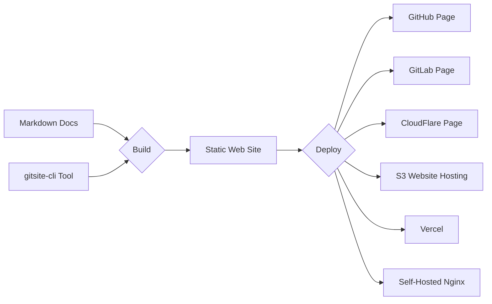

# gitsite

  

GitSite can build your well-organized Markdown documents and other resources to static web site deployed to GitHub pages, etc.

### [https://gitsite.org](https://gitsite.org)

```mermaid
flowchart LR
    md[Markdown Docs]
    gitsite[gitsite-cli Tool]
    build{Build}
    deploy{Deploy}
    html[Static Web Site]
    md --> build
    gitsite --> build
    build --> html
    html --> deploy
    deploy --> github[GitHub Page]
    deploy --> gitlab[GitLab Page]
    deploy --> cloudflare[CloudFlare Page]
    deploy --> s3[S3 Website Hosting]
    deploy --> vercel[Vercel]
    deploy --> nginx[Self-Hosted Nginx]
```
