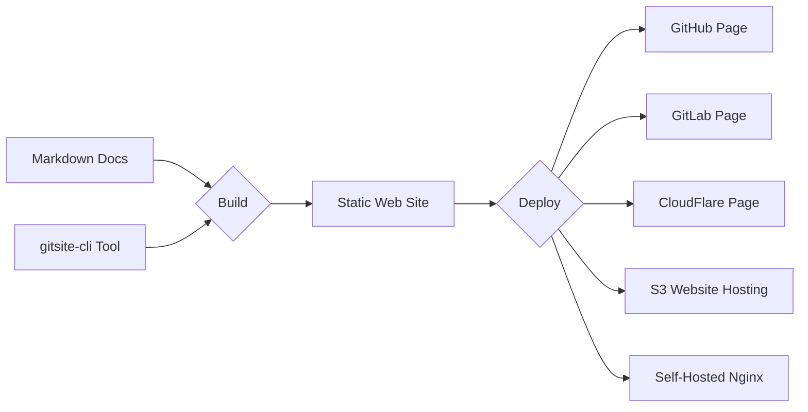

# Home

Rapidly build modern websites

from Markdown documents in Git

GitSite build your well-organized Markdown documents and other resources to static web site that can be deployed simply to GitHub page, etc.

Manage your docs in Git repository and rebuild on changes automatically.

