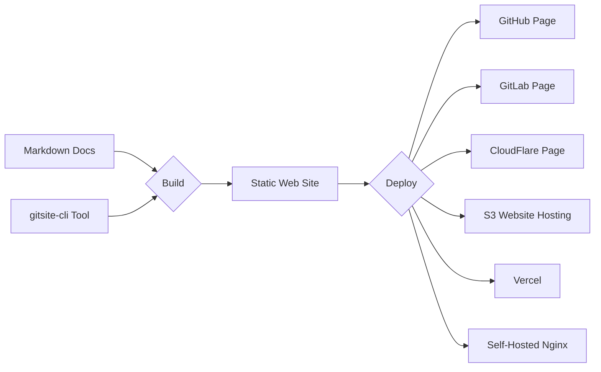

# Home

# Rapidly build modern websites from Markdown documents in Git

---

### GitSite can build your well-organized Markdown documents with other resources to static web site deployed to GitHub pages, etc.

Example:

A GitHub Repo: [https://github.com/michaelliao/gitsite](https://github.com/michaelliao/gitsite) can be deployed to:

- GitHub: [https://gitsite.org](https://gitsite.org)
- GitLab: [https://gitlab.gitsite.org](https://gitlab.gitsite.org)
- Cloudflare: [https://cloudflare.gitsite.org](https://cloudflare.gitsite.org)
- Vercel: [https://vercel.gitsite.org](https://vercel.gitsite.org)

### GitSite supports Markdown documents, embedded videos, mathematical expressions, ASCII art, QR code, diagrams, and even sheet music!

# [Read User Guide »](/books/gitsite-guide/index.html)
