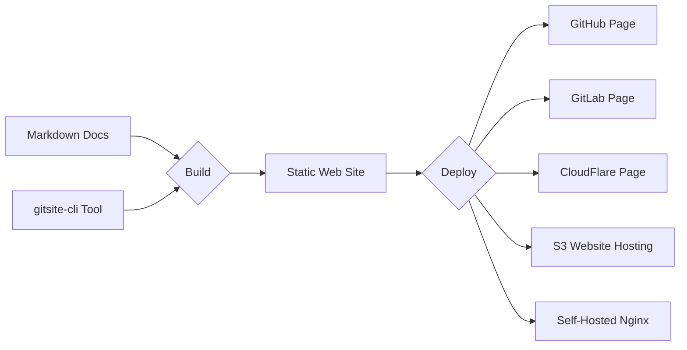

# Home

Rapidly build modern websites from Markdown documents in Git

GitSite build your well-organized Markdown documents and other resources to static web site that can be deployed simply to GitHub page, etc.

GitSite supports Markdown documents, embedded videos, mathematical expressions, ASCII art, QR code, diagrams, and even sheet music!

