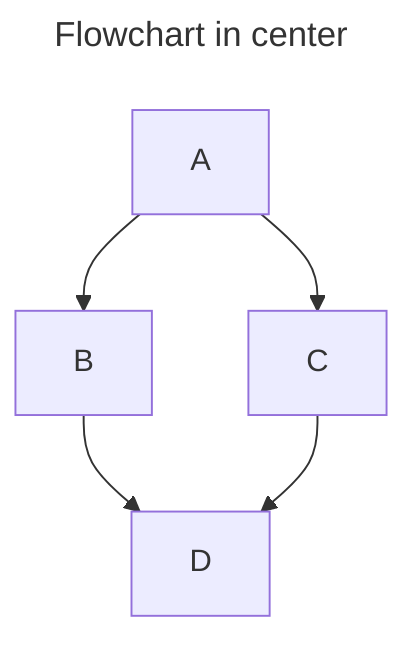

# Diagrams

You can create diagrams to convey information through charts and graphs.

## Creating Mermaid diagrams

Mermaid is a Markdown-inspired tool that renders text into diagrams. For example, Mermaid can render flow charts, sequence diagrams, pie charts and more. For more information, see the [Mermaid documentation](https://mermaid.js.org).

To create a Mermaid diagram, add Mermaid syntax inside a fenced code block with the `mermaid` identifier.

For example, you can create a flow chart by specifying values and arrows.

    ```mermaid
    graph TD;
        A-->B;
        A-->C;
        B-->D;
        C-->D;
    ```


## Alignment

To align a Mermaid diagram, add `left`, `center` or `right` after the `mermaid` identifier:

    ```mermaid center
    ---
    title: Flowchart in center
    ---
    graph TD;
        A-->B;
        A-->C;
        B-->D;
        C-->D;
    ```

